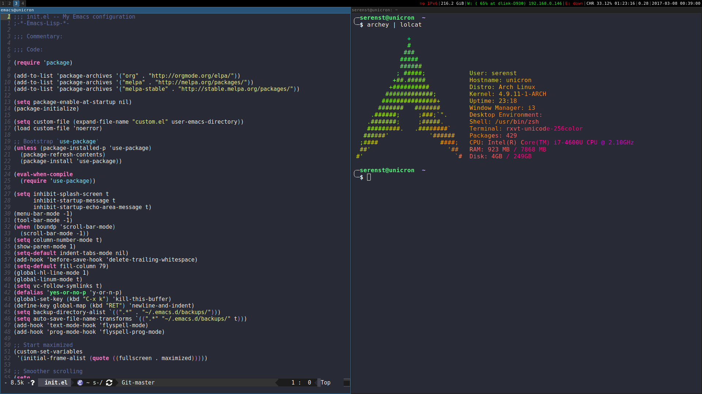

dotfiles
========



Install [GNU Stow](https://www.gnu.org/software/stow/).

```bash
sudo pacman -S stow
```

Each directory is a Stow "package" (a related collection of files and
directories administered as a unit). Stow's default action is to create
symbolic links from the target tree to the package tree. The default target
tree is the parent of the current directory.

Use Stow to install one or more packages:

```bash
stow bspwm gtk vim X zsh
```

vim/neovim
----------

Install [neovim](https://neovim.io/), `xclip` (clipboard support), `ctags`, and the Python 2/3
neovim Python modules.

```bash
sudo pacman -S neovim xclip ctags
sudo pip install neovim
sudo pip2 install neovim
```

Link the `vim` and `neovim` configuration.

```bash
mkdir -p ~/.vim
ln -s ~/.vim ~/.config/nvim
ln -s ~/.vimrc ~/.config/nvim/init.vim
```

Create undo and tags directories.

```bash
mkdir -p ~/.vim/undo
mkdir -p ~/.vim/tags
```

### Plugins

Install [plug.vim](https://github.com/junegunn/vim-plug)

```bash
curl -fLo ~/.vim/autoload/plug.vim --create-dirs \
    https://raw.githubusercontent.com/junegunn/vim-plug/master/plug.vim
```

[YCM plugin](https://github.com/Valloric/YouCompleteMe) installation requires
CMake

```bash
sudo pacman -S cmake
```

Install plugins and all the necessary binaries for the [vim-go
plugin](https://github.com/fatih/vim-go).

```
:PlugInstall
:GoInstallBinaries
```

Install [the_silver_searcher](https://github.com/ggreer/the_silver_searcher).

```bash
sudo pacman -S the_silver_searcher
```

Install the Python and JavaScript libraries required by the plugins:

```bash
sudo pip2 install isort flake8 pylint
sudo npm install -g jshint
```

Window Manager
--------------

### bspwm

[bspwm](https://github.com/baskerville/bspwm) is a tiling window manager that
represents windows as the leaves of a full binary tree.

```bash
sudo pacman -S bspwm

cat << EOF > /usr/share/xsessions/bspwm.desktop
[Desktop Entry]
Encoding=UTF-8
Name=bspwm
Comment=Binary space partitioning window manager
Exec=bspwm
Type=Application
EOF
```

### sxhkd

[sxhkd](https://github.com/baskerville/sxhkd) is a simple X hotkey daemon with
a powerful and compact configuration syntax. sxhkd is used to communicate with
bspwm through bspc as well as launch your applications of choice.

[rofi](https://www.archlinux.org/packages/community/x86_64/rofi/), `i3lock`,
and `xorg-xbacklight` are required for some of the keybindings.

```bash
sudo pacman -S sxhkd i3lock xorg-xbacklight
```

Wallpaper
---------

Install [feh](http://feh.finalrewind.org/) to set the desktop wallpaper:

```bash
sudo pacman -S feh
```

GTK
---

[GTK+](http://www.gtk.org/), or the GIMP Toolkit, is a multi-platform toolkit
for creating graphical user interfaces. Some notable applications that use GTK+
as a widget toolkit include
[Firefox](https://www.mozilla.org/en-US/firefox/new/) and
[GIMP](https://www.gimp.org/).

Install the [arc gtk theme](https://aur.archlinux.org/packages/gtk-theme-arc/)
and the [numix circle icon
theme](https://aur.archlinux.org/packages/numix-circle-icon-theme-git/).

xmodmap
-------

[xmodmap](http://www.x.org/archive/X11R6.8.2/doc/xmodmap.1.html) is a utility
for modifying keymaps and pointer button mappings in Xorg.

```bash
sudo pacman -S xorg-xmodmap
```

URxvt
-----

[rxvt-unicode](http://software.schmorp.de/pkg/rxvt-unicode.html) (commonly
known as URxvt) is a highly customizable terminal emulator forked from rxvt.

```bash
sudo pacman -S rxvt-unicode
```

Install the following perl extensions:
* [urxvt-resize-font-git](https://aur.archlinux.org/packages/urxvt-resize-font-git/)

### Font

The font for the URxvt terminal can be set through the font configuration
parameters in `.Xresources`.

Install the `Dejavu` font family:

```bash
sudo pacman -S ttf-dejavu
```

